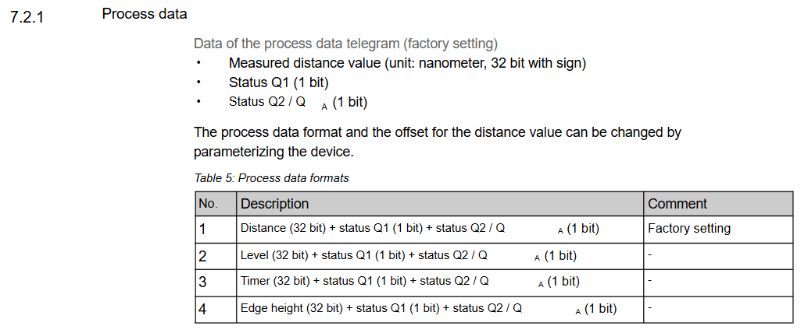

#LƯU Ý KHI ĐỌC DỮ LIỆU TỪ CẢM BIẾN SICK THÔNG QUA IO-LINK

+ Format chung của chuẩn PDI48 (32BIT)/(8BIT)/(8BIT)
+ Tuy nhiên ở một số cảm biến 32bit có thể là kiểu int, uint, hoặc float (đọc từ datasheet của nhà sản xuất). Cho nên không thể viết 1 hàm chuyển đổi data chung cho tất cả các thiết bị của SICK.

Format Data của một số thiết bị SICK

Hình 1: WTM10L
 

Hình 2: MPB10
 

Hình 3: OD2000
 

